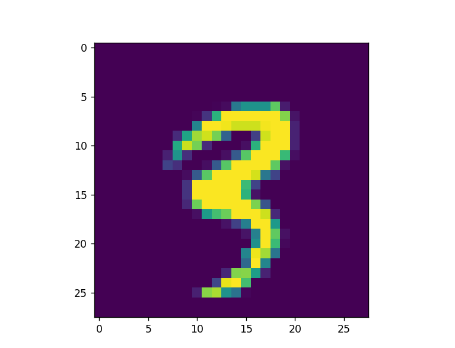

#### What are Neural networks

Lets imagine you have the image of cats, dogs, humans. And you want a neural network that can differenciate 
an image of dogs, cats humans.

you will have features, (they mostly are numerical values). It can be categorical features as well.

Input -> Hidden Layers -> Output 

Every neuron has a connection to another neuron.
Each connection is a weight.
Input value will get multiplied by a weight.(optional bias can be added), all summed and passed through an
activation function.

We will work with MNIST dataset. It is a hand drawn numbers dataset

expected result for part2

